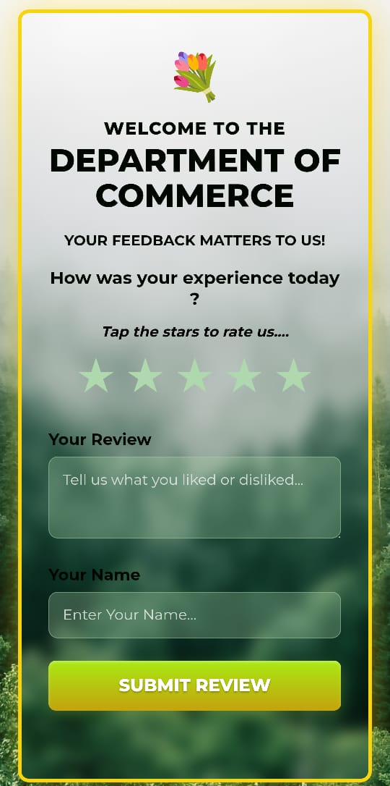

# 🌿 Department of Commerce - Feedback & Review Page

A beautiful, responsive, and interactive feedback form designed with a nature/forest theme. This project features a glassmorphism UI, a dynamic star rating system, 
and a **serverless backend** using Google Sheets to store user reviews.



## 🚀 Features

* **Responsive Design:** Fully optimized for mobile, tablet, and desktop screens.
* **Serverless Data Storage:** Submits data directly to a Google Sheet (no database costs).
* **Interactive UI:**
    * Hover-fill star rating animations.
    * Glassmorphism (frosted glass) input fields.
    * 3D-effect gradient submission button.
* **Visuals:** Fixed forest background with a golden-frame aesthetic.
* **Zero Dependencies:** Built with pure HTML, CSS, and JavaScript.

## 🛠️ Tech Stack

* **Frontend:** HTML5, CSS3, JavaScript (ES6)
* **Backend:** SheetDB
* **Database:** Google Sheets
* **Fonts:** Google Fonts (Montserrat)

## 📂 Project Structure

```text
/
├── index.html       # The main entry point containing HTML, CSS, and JS
├── README.md        # Documentation
